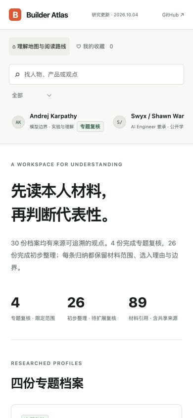

# Builder Atlas / AI 建造者阅读档案

中文：AI 建造者观点研究工作台，30 个研究对象全部补入当前观点。Zara Zhang、Matt Pocock、Emil Kowalski 与 Andrej Karpathy 保留专题复核；其余 26 份完成初步整理，新增 56 条材料引用、74 条主题归纳。逐条展示出处、章节、阅读范围、选入理由与边界。本人文章、帖子、访谈摘录、节目方摘要和团队材料区分归属，不声称完整看过视频或穷尽作者思想。本次未重新采集所有账号最近 100 条 X；旧 X 总结保留为待复核线索。支持搜索、阅读路线、本地收藏与练习笔记。旧稿留在 legacyDraft 供追溯。

English: A research workbench for 30 builders and official sources. Four profiles retain thematic re-review; the other 26 now have preliminary source-bound themes, adding 56 material references and 74 claims. Each claim includes source locations, access scope, selection reasons, and limitations. Signed articles, selected posts, original interview transcripts, public previews, and official team materials are attributed separately. A preliminary label does not establish an author's complete worldview. This expansion did not collect the latest 100 X posts for every account; older X summaries remain pending review. Search, reading paths, responsive layouts, local bookmarks, and exercise notes are included. Superseded drafts remain in legacyDraft.



## 在线体验 / Live Demo

- [GitHub Pages Demo](https://holynova.github.io/builder-atlas/)
- [Cloudflare Demo](https://builder-atlas.xiaosang.cc/)
- [GitHub Repo](https://github.com/holynova/builder-atlas)


## 本地运行 / Run locally

```bash
npm ci
npm run dev
```

Open http://localhost:8765/.

## 发布 / Deploy

```bash
npm run check
npm run deploy:check
npm run deploy
```

Cloudflare Workers · Worker Route: `builder-atlas.xiaosang.cc`

Version: **1.4.0**. Source and deployment configuration use the same `main` branch. Deploy manually from that commit; no Cloudflare release branch or deployment workflow.

页面包含统一 Umami 统计。原文版权属于各作者；此项目提供原创中文转述与来源链接。

GitHub Pages publishes the static `dist/` directory from `main` using `.github/workflows/pages.yml`. Cloudflare remains a separate manual deployment.

## 研究维护 / Research maintenance

Canonical data lives in `dist/research.json`, `dist/learning.json`, and `dist/x-insights.json`. Run `npm run sync:data` after editing, then `npm run check`. Per-profile research notes live in `research/`. A reviewed label applies only to the listed materials, not the author’s entire output.
