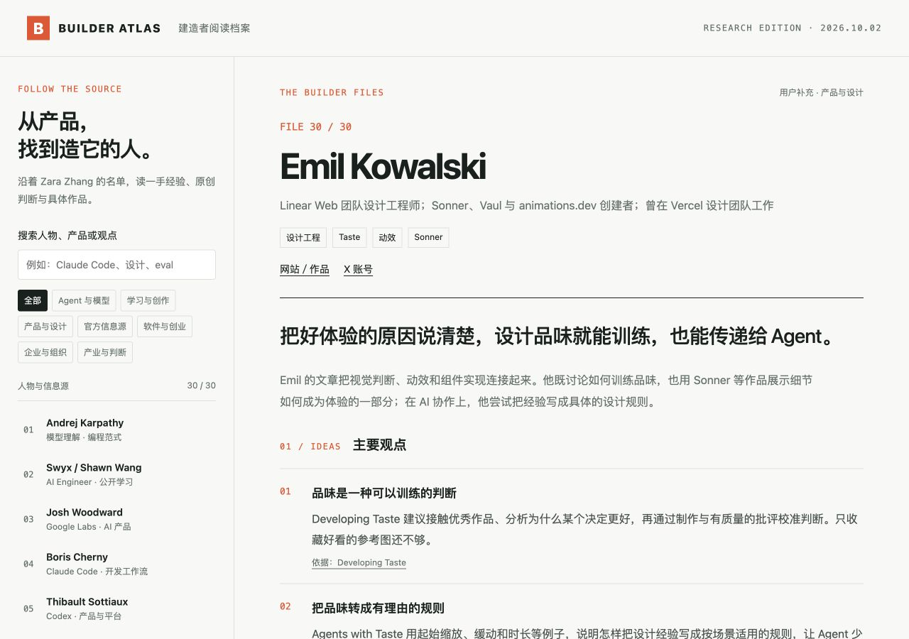

# Builder Atlas / AI 建造者阅读档案

中文：从 Zara Zhang 的名单出发，整理 30 份 AI 建造者与官方信息源档案、66 条代表文章、推文和访谈。按 Karpathy 的理解方法重组内容：问题入口、观点地图、分步讲解、编辑练习及四条阅读路线。首页用同一个例子展示文字、图解、交互网页和视频脚本的区别。支持搜索、主题筛选及手机阅读。视频脚本不是已生成的视频。中文总结链接到原始依据，并标注付费、转存和未读取全文的资料。代表内容研究快照为 2026 年 10 月 2 日。新增近期 X 观点：10 月 3 日采集 9 个账号的 837 条帖子，提炼 27 条观点并附原帖；其余账号显示采集待补状态。

English: A source-linked reading atlas with 30 AI builder and official-source profiles and 66 representative articles, posts, talks and interviews. A Karpathy-inspired learning edition adds question-led profiles, clickable idea maps, step-by-step explainers, editorial exercises and four reading paths. A shared example compares clear text, diagrams, interactive HTML and a video storyboard; no video file is generated. Search people, products or ideas, filter topics, and read on mobile. Chinese summaries distinguish personal views, team work and access limitations. Research snapshot: October 2, 2026. Recent X insights add 27 source-linked summaries from 837 posts across 9 accounts, collected October 3; remaining profiles show the collection status.



## 在线体验 / Live Demo

- [GitHub Pages Demo](https://holynova.github.io/builder-atlas/)
- [Cloudflare Demo（DNS 待配置）](https://builder-atlas.xiaosang.cc/)
- [GitHub Repo](https://github.com/holynova/builder-atlas)


## 本地运行 / Run locally

```bash
npm ci
npm run dev
```

Open http://localhost:8765/.

## 发布 / Deploy

```bash
npm run check
npm run deploy:check
npm run deploy
```

Cloudflare Workers · Worker Route: `builder-atlas.xiaosang.cc`

Version: **1.2.1**. Source and deployment configuration use the same `main` branch. Deploy manually from that commit; no Cloudflare release branch or deployment workflow.

页面包含统一 Umami 统计。原文版权属于各作者；此项目提供原创中文转述与来源链接。

DNS prerequisite: proxied A record `builder-atlas` → `192.0.2.1` in the `xiaosang.cc` zone. The Worker handles requests; this reserved address is a placeholder, not a live origin. Worker Route preserves the same HTTPS Demo when Custom Domains reach the zone limit.

GitHub Pages publishes the static `dist/` directory from `main` using `.github/workflows/pages.yml`. Cloudflare remains a separate manual deployment.
