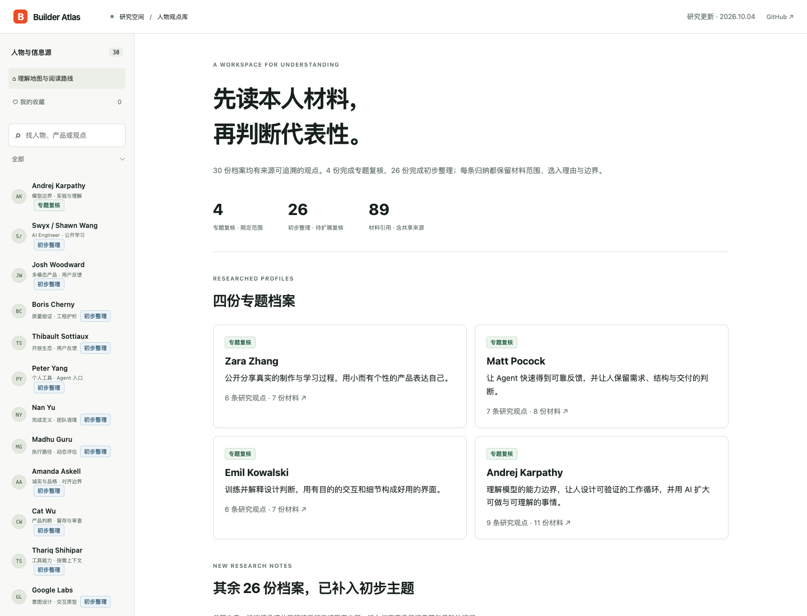

# Builder Atlas · AI建造者阅读档案

浏览30份来源绑定的建造者档案，按阅读路线查看观点、出处、收藏和练习笔记。

A source-bound reading workbench for 30 builders, with reading paths, bookmarks and notes.

[在线体验](https://builder-atlas.xiaosang.cc/) · [源码](https://github.com/holynova/builder-atlas)



## 可以做什么

- 逐条展示来源、阅读范围与整理边界。
- 搜索、阅读路线、本地收藏与笔记帮助持续学习。

## 从一篇材料开始

搜索一位建造者或选择阅读路线，打开观点条目的出处，再用本地收藏和练习笔记记录自己的理解。

4份档案保留专题复核，26份为初步整理。标签只针对列出的材料；未穷尽作者观点，也未重新采集每个账号最新100条X。文章、访谈与团队材料分别归属，旧稿保留供追溯。

## 本地运行与维护

```bash
npm ci
npm run dev
# 修改数据后
npm run sync:data
npm run check
```

打开 http://localhost:8765/。数据位于 `dist/research.json`、`dist/learning.json` 和 `dist/x-insights.json`，维护记录位于 `research/`。原文版权属于各作者。


## 发布

```bash
npm run deploy
```

从 `main` 同一提交在本地手动发布到Cloudflare Workers。正式地址：[https://builder-atlas.xiaosang.cc/](https://builder-atlas.xiaosang.cc/)。
